#API Connect Hands-On Labs

##Exercise 9: Tour B - Generate a Developer Portal for your APIs

### Prerequisites

Make sure you've met the following prerequisites.

**Prerequisite 1**: Completed Exercise 2 ([Exercise 2](../ex2))

### Overview of exercise

We followed the "Getting Started" tour to use the API Connect manager and invoke the APIs within the API Connect manager. We will pick up from where we left off at the previous exercise. 

In this exercise, we will publish the APIs, with an associated plan and so on to a self-service developer portal which is an adjunct to the Bluemix API Connect service. These APIs can be invoked by any REST-based client.

### Publishing the Sample API to the Developer Portal

Let's head back to the API Connect Manager on IBM Bluemix and to the sandbox that we finished off in exercise 2 as we see below. You can click on the Dashboard tab on the Bluemix console and then on the API connect service as shown below.

<!--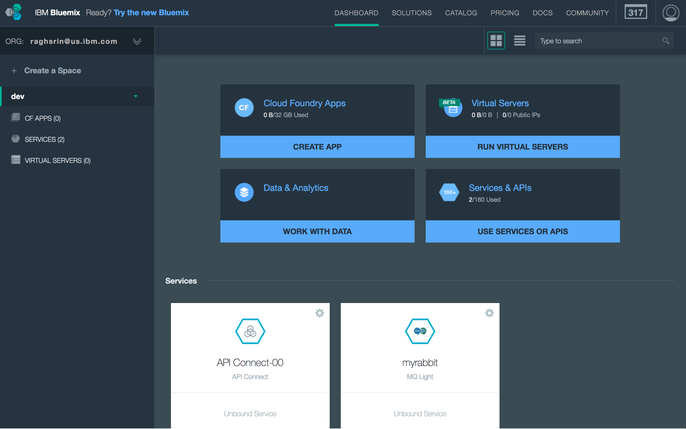-->

This will bring up the Dashboard for the API Connect manager as shown below.

<!---->

Select the "Settings" tab, pick "Portal" and pick the "IBM Developer Portal". Finally click Save icon on the top right as shown below.

<!--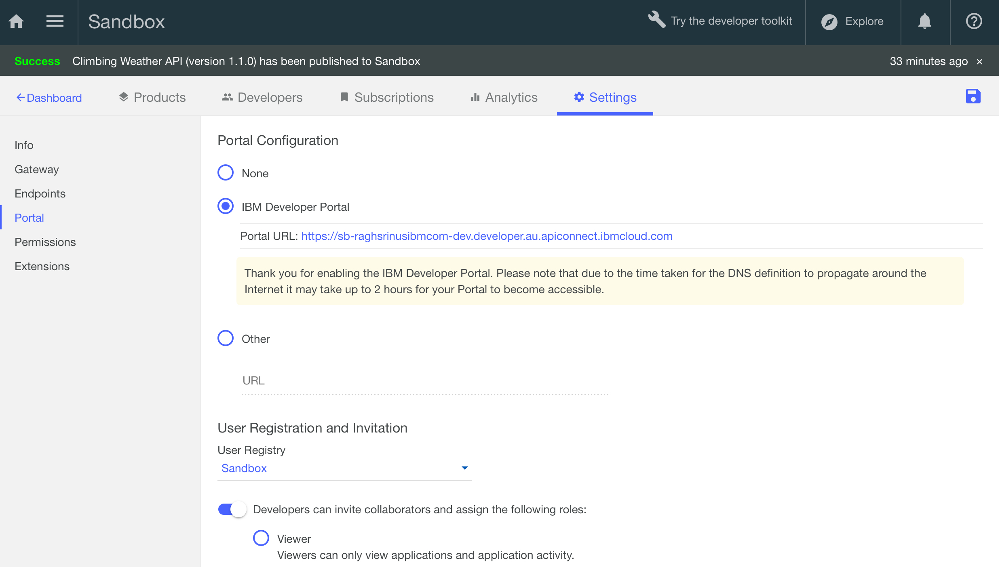-->

Wait for the email to arrive that the developer portal is ready as the dialog box below indicates. **This might take a few minutes.**

<!---->

Clicking on the link will take you to the developer portal. Reset the password for `admin` as shown below.

<!---->

You will see the "Climbing Weather API" as seen below.

<!---->

We will next publish this API to Bluemix.

### Publishing the Sample API to Bluemix

We will go back to the API Connect Manager. If required, re-login to the API Connect Manager as shown below.

<!--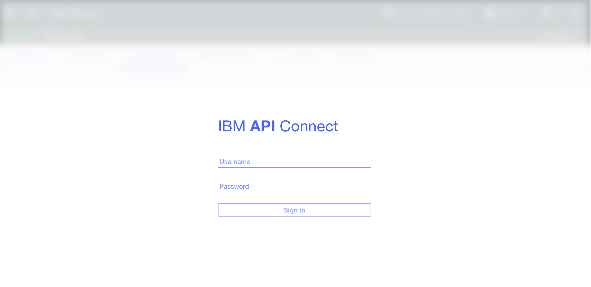-->

In the API Connect Manager on Bluemix click on "Developers" in the navigation pane and "Add Bluemix organization" as shown below.

<!---->

Provide the email address substituting the address with your Bluemix email address as shown below.

<!---->

Select the Bluemix org and hit "Confirm" as shown below.

<!--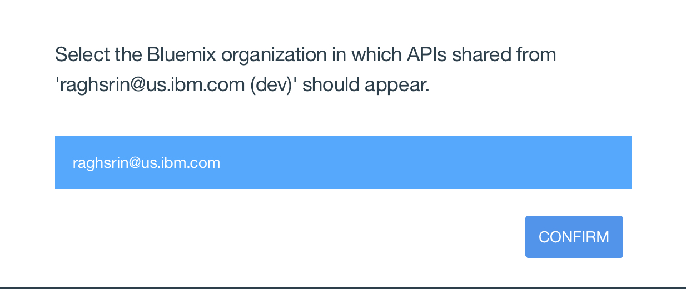-->

Now back in the API Connect Manager click on the "Products" tab and click on "..." tab which should bring up the popup menu as shown below and clik on "Edit visibility".

<!--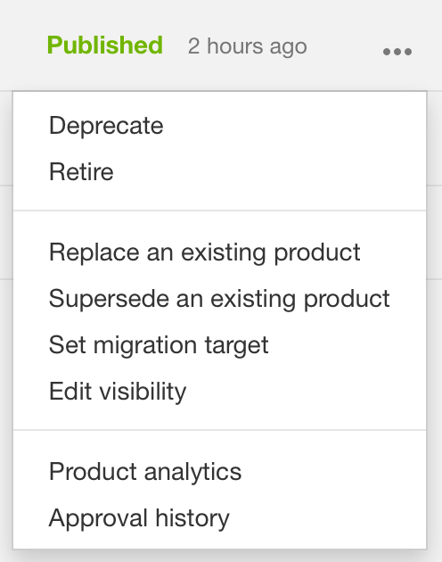-->

Change the visibility to "Custom" and add the organization (substituting your own organization) and Bluemix. Finally hit "Republish" as shown below.

<!--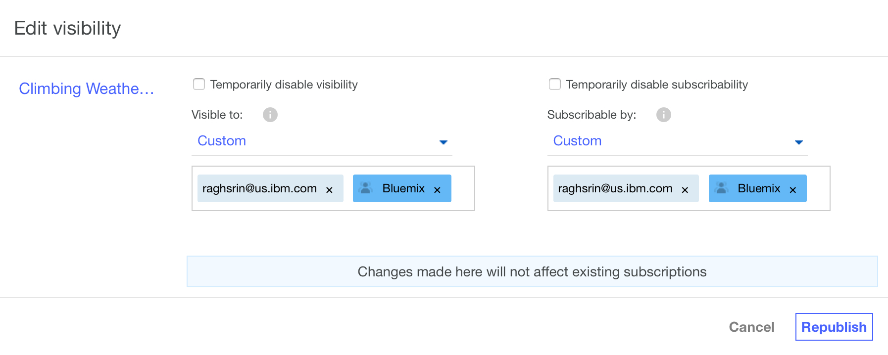-->

The Climbing Weather API product is displayed in the Explore APIs tab of the API Connect Dashboard. If you click, Climbing Weather App 1.0.0 it will take you to the API in the Developer Portal.

### Registering an app for the sample API in the Developer Portal

Back in the Developer Portal logout from admin as shown below.

<!--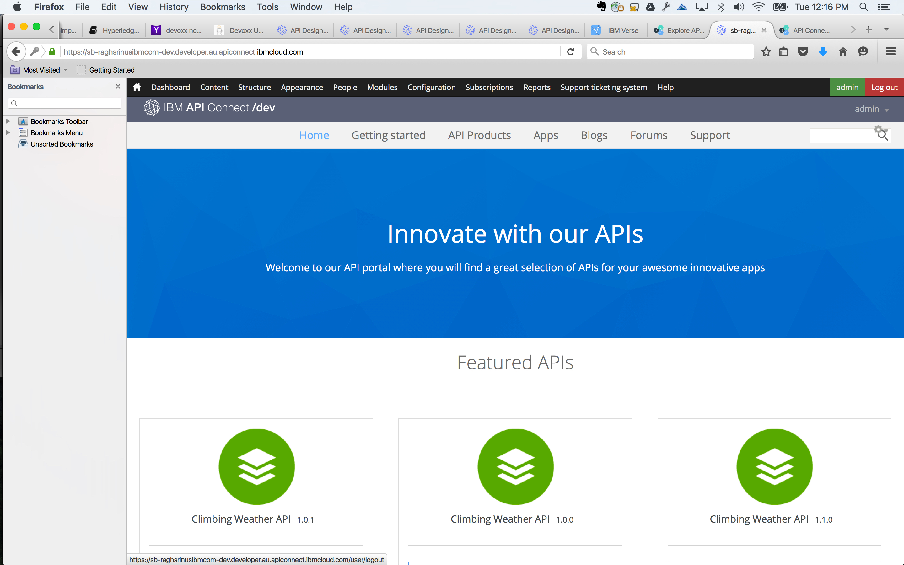-->

Click on "Create an account" as shown below.

<!--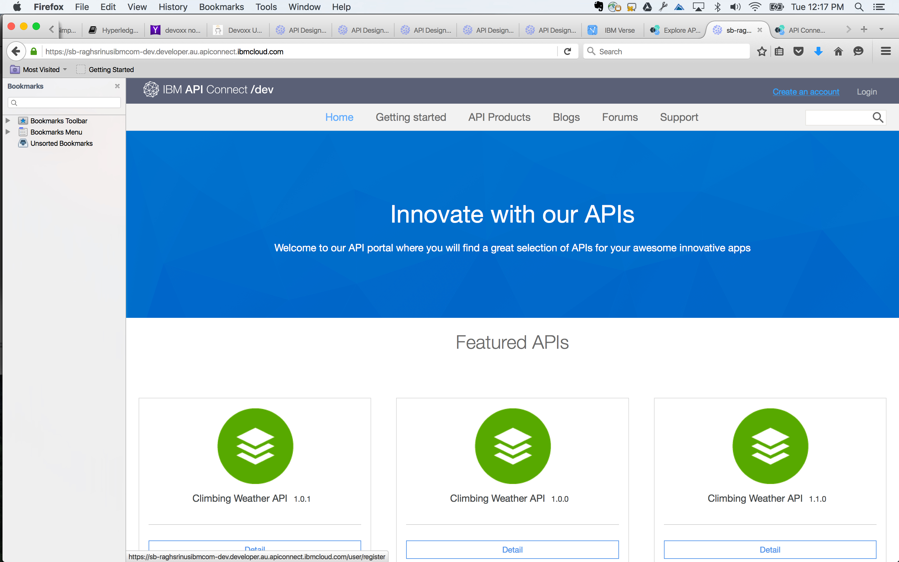-->

Complete the form and ensure that you use a different email address.

You should see an account ativation complete as shown below.

<!--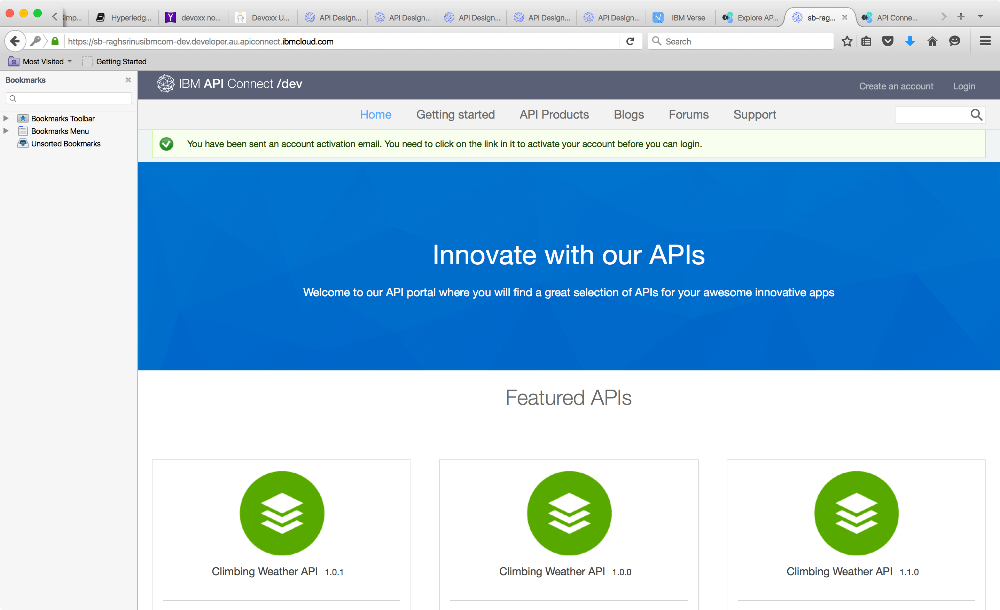-->

After the email arrives at this second login with the account details, click on the link which will bring up the portal as below.

<!---->

Click the API Products and Climbing Weather API. You can see that Climbing Weather API belongs to a default Plan with a rate limit of 100 calls per minute as shown below.

<!--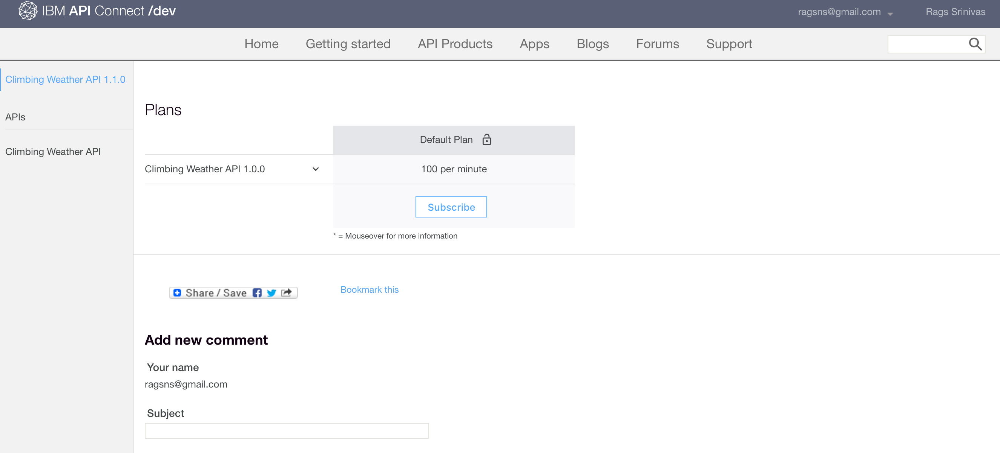-->

Click on the "Climbing Weather API 1.0.0" tab as shown below.

<!--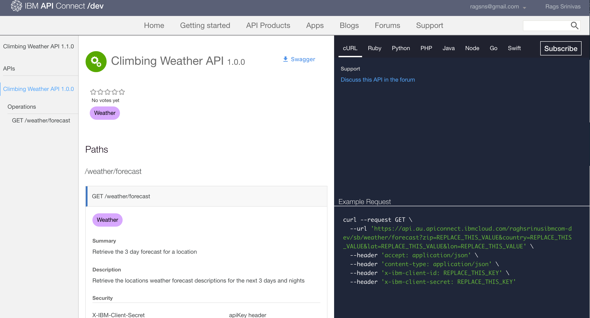-->

Click on the "Apps"navigation pane of the Developer Portal, click "Register a new Application" as shown below.

<!---->

Fill in the details and hit "Submit".

<!--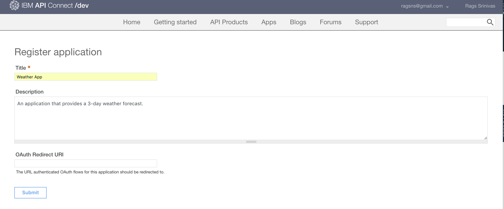-->

Click Show to display the "**Client secret**" that we will use subsequently as shown below.

<!--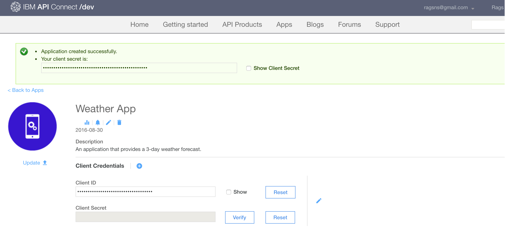-->

Click "API Products" and the "Climbing Weather API" as shown below.

<!---->

The details of the Plan that is named Default Plan are displayed. Click "Subscribe" as shown below.

<!--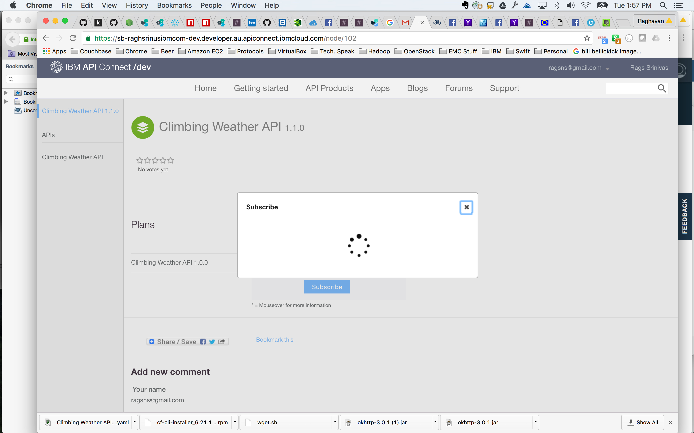-->

This will bring up a dialog box. Click on "Subscribe" as shown below.

<!--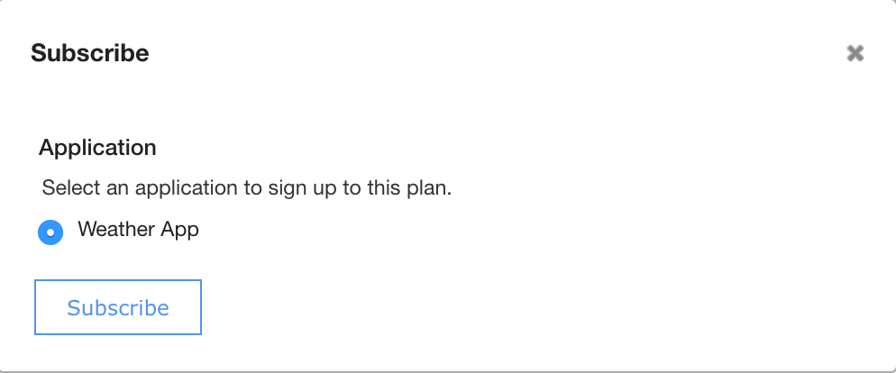-->

You have registered to the Climbing Weather App application and subscribed it to a Plan.

### Testing the Climbing Weather API in the Developer Portal

Back in the Developer Portal, In the left navigation pane, click Climbing Weather API. In the "Try this operation" section of the console, ensure that the Weather App application is selected and enter the parameters as shown below including the "Client secret" that was noted from the earlier step and click "Call Operation".

<!---->

That should provide a response which is shown below.

<!--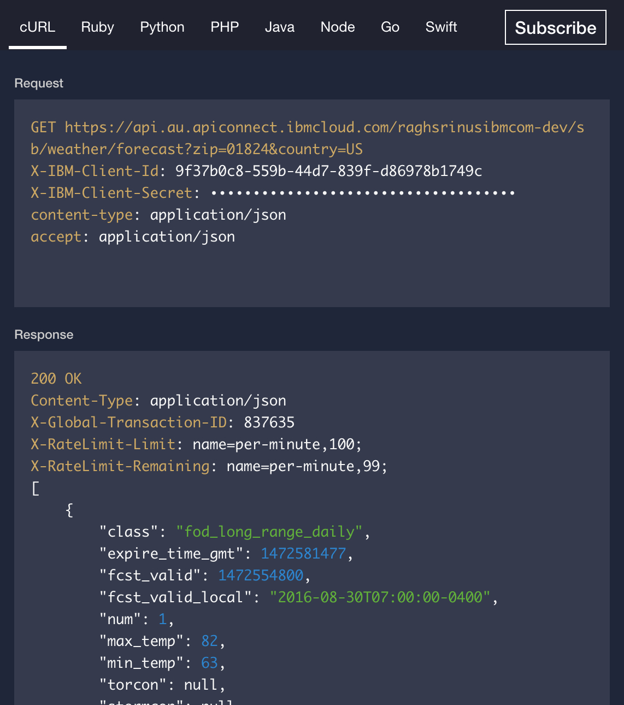-->

### Summary of exercise and next steps

We started with the API connect product locally in exercise 1 and looked at how to use the same service on Bluemix via the Sample in Exercise 2.

In this exercise, we published the product to a developer portal that is an adjunct service with the API connect service on Bluemix.

You could follow a similar journey to publish your own APIs aroud your own user-generated data. You can use the variety of connectors availble via API Connect.

### Final Summary

In conclusion, we covered the usage of the API Connect Manager locally and on Bluemix, how to create models locally, publish them on Bluemix and explore the APIs.

Finally we published the APIs on a self-service developer portal which provides API-based services including providing service keys, throttling, etc. without having to write any code.

**Congratulations! You are done!!**

